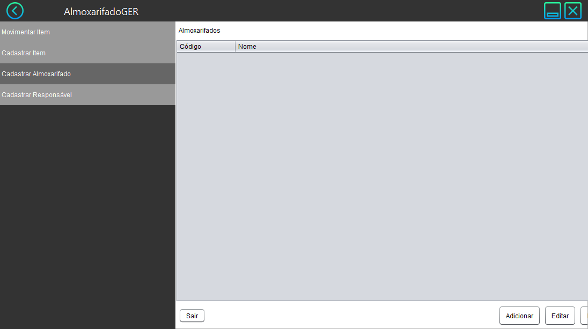
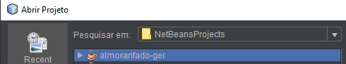
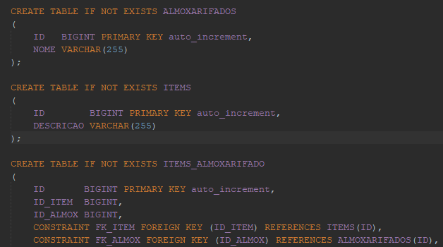
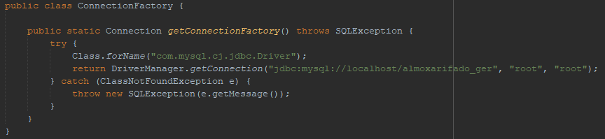
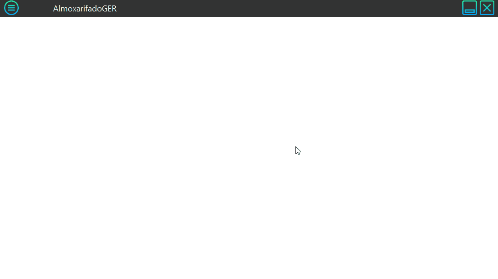

almoxarifado-ger
================
Sistema de almoxarifado em Java Swing e banco MySQL

Java SE 8, MySQL 8.0

## Instalação
Abra a pasta do projeto no NetBeans

>Caso tenha clonado o projeto, basta abrir direto no NetBeans no menu Arquivo → Abrir Projeto (Ctrl + Shift + O);
>Caso tenha baixado o zip direto no GitHub, descompacte o arquivo e faça o processo acima.

### Banco
Dentro do projeto, no pacote **almoxarifadoger.controller**, você encontrará o script **SQLCreateDB**

Execute o script no MySQL

### Conexão com o Banco
Também no pacote **almoxarifadoger.controller**, abra o **ConnectionFactory**

Altere o usuário e senha do banco

---
Finalizado os passos basta executar!

>Eu literalmente fiz esse sistema pra um amigo for a fistful of dollars